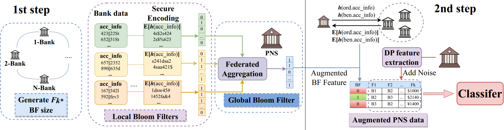

# Scarlet PETs
This repository provides software for Team Scarlet PETs' solution to the [U.S. PETs Prize Challenge](https://petsprizechallenges.com) (Financial Crime Prevention). Scarlet PET's solution won the [first place](https://www.whitehouse.gov/ostp/news-updates/2023/03/31/us-uk-annouce-winners-innovation-pets-democratic-values/) in the Challenge.

# Anomaly Detection via Privacy-Enhanced Two-Step Federated Learning

## Link to the Competition
- https://petsprizechallenges.com/
- https://www.drivendata.org/competitions/group/nist-federated-learning/
- https://www.drivendata.org/competitions/105/nist-federated-learning-2-financial-crime-federated/
- https://www.drivendata.org/competitions/144/nist-federated-learning-2-financial-crime-centralized/


## Problem Description: US-PETs Financial Crime Prize

Financial institutions such as banks and credit agencies, and organizations that process transactions between institutions, must protect personal and financial federated data while also trying to report and deter illicit financial activities. In this context, the federated problem setting, considered in the challenge, is as follows: A Payment Network System (PNS) connects multiple financial institutions to make transactions. The PNS has the transactional data, while institutions (e.g., banks) have private and confidential information on the accounts (of their clients). The aim is to develop a privacy-enhancing federated learning (FL) solution to build an anomaly detection model over federated data. The FL-based solution will facilitate cross-institution and cross-border anomaly detection to combat financial crime.


Details see the following link:
- https://www.drivendata.org/competitions/98/nist-federated-learning-1/page/524/
- https://www.drivendata.org/competitions/105/nist-federated-learning-2-financial-crime-federated/
- https://www.drivendata.org/competitions/144/nist-federated-learning-2-financial-crime-centralized/


## Our Approach
We developed a novel privacy-preserving (PP) two-step federated learning approach to identify anomalous financial transactions. In the first step, we performed PP feature mining for account-level banks’ data, followed by their augmentation to the payment network’s data using a PP encoding scheme. In the second step, a classifier is learned by the messaging network from the augmented data. A key benefit of our approach is that the performance in the federated setting is comparable to the performance in the centralized setting, and there is no significant drop in accuracy. Furthermore, our approach is extremely flexible since it allows the messaging network to adapt its model and features to build a better classifier without imposing any additional computational or privacy burden on the banks.



### [Centralized Solution Documentation](./centralized_solution/README.md)

### [Federated Solution Documentation](./federated_solution/README.md)

## How to Install:

- Install python > 3.8

- Set up and activate virtualenv

  ```shell
  python -m venv ./venv
  
  # window gitbash
  source ./venv/Scripts/activate
  
  # linux/unix
  source ./venv/bin/activate
  ```

- Install Flower framework

  ```shell
  pip install -U flwr["simulation"]
  ```

- Install all other packages

  ```shell
  pip install -r requirements.txt
  ```

- Packages Used

  - mmh3 - to compute hash value
  - pycryptodome - to encrypt and decrypt data
  - xgboost - to train model
  - flower - federated learning framework
  - others: joblib, loguru, hyperopt, scikit-learn

## How to Run:

- **Centralized Solution**

  ```shell
  # centralized_solution solution
  cd centralized_solution
  python solution_centralized.py
  ```

- **Federated Solution**

  ```shell
  # federated solution 
  cd federated_solution
  python solution_federated.py
  ```


## Dataset Requirement and Description

For details see the following link:
- https://www.drivendata.org/competitions/98/nist-federated-learning-1/page/524/

### Demo Datasets

Due to the confidentiality and privacy constraints, the dataset for the competition is not released publically. Therefore, to help you run the program, we have crafted a fake synthetic demo dataset, which is provided under **`new_data/`** folder of `/federated_solution` and `/centralized_solution`. In federated solution, **`new_data/`** folder contains subfolders whose names are denoted by name of clients, each of which contains the data owned by the client. That is, each bank client will have data from its own accounts, and payment network system (PNS) will have access to the transaction data.

#### Account Dataset owned by Bank Clients

The general format of dataset for bank clients is as follows:

- **Account information:** `Bank`, `Account`, `Name`, `Street`, `CountryCityZip`
- **Flags**: categorical or ordinal value indicating whether risk of account, for example, 0 means no risk, 1 means low risk

Example of a synthetic fake dataset used in demo is as follows:

| Bank     | Account        | Name        | Street      | CountryCityZip       | Flags |
| -------- | -------------- | ----------- | ----------- | -------------------- | ----- |
| BANK1682 | ACCOUNT74089   | acctname25  | address 200 | country_city_zip 175 | 0     |
| BANK1682 | ACCOUNT91126   | acctname186 | address 107 | country_city_zip 22  | 0     |
| BANK1682 | ACCOUNT2352638 | acctname131 | address 157 | country_city_zip 155 | 0     |

#### Transaction Dataset owned by Payment System Organization

The general format of dataset for PNS client is as follows:

- **Transaction IDs:** `TransactionId`

- **Transaction Time:** `Timestamp`, `SettlementDate`
- **Transaction Accounts:** `Sender`, `Receiver`, `OrderingAccount`, `BeneficaryAccount`, ...
- **Transaction Currency and Amount:** `SettlementAmount`, `InstructedAmount`, `SettlementCurrency`, `InstructedCurrency`
- **Label:** whether transaction is anomalous or not

Example of a synthetic fake demo dataset is as follows:

| TransactionId | Timestamp      | Sender   | Receiver | OrderingAccount | OrderingName | OrderingStreet | OrderingCountryCityZip | BeneficiaryAccount | BeneficiaryName | BeneficiaryStreet | BeneficiaryCountryCityZip | SettlementDate | SettlementCurrency | SettlementAmount | InstructedCurrency | InstructedAmount | Label |
| ------------- | -------------- | -------- | -------- | --------------- | ------------ | -------------- | ---------------------- | ------------------ | --------------- | ----------------- | ------------------------- | -------------- | ------------------ | ---------------- | ------------------ | ---------------- | ----- |
| M1            | 2/6/2055 17:44 | BANK6242 | BANK1682 | ACCOUNT421876   | acctname60   | address 111    | country_city_zip 90    | ACCOUNT551369      | acctname154     | address 197       | country_city_zip 132      | 550206         | currency 41        | 1                | currency 4         | 1                | 0     |
| M2            | 2/9/2055 23:21 | BANK2501 | BANK1682 | ACCOUNT3176524  | acctname192  | address 38     | country_city_zip 160   | ACCOUNT1           | acctname86      | address 76        | country_city_zip 99       | 550209         | currency 4         | 1                | currency 4         | 1                | 1     |
| M3            | 2/3/2055 4:10  | BANK65   | BANK2602 | ACCOUNT6331626  | acctname152  | address 127    | country_city_zip 49    | ACCOUNT857376      | acctname37      | address 34        | country_city_zip 101      | 290218         | currency 141       | 1                | currency 6         | 1                | 1     |

#### Training and Testing Data of Payment System Organization

PNS client owns the transaction data, and the anomaly transaction detection will be carried out at its side; note that transaction data also contains the **label** which denotes whether a transaction is an anomaly or not. The transaction data will be split into training and test data to learn and evaluate the anomaly detection model. `Transaction_train.csv` and `Transaction_test.csv` respectively contain training and test data.


