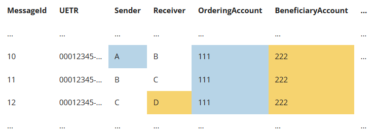

# Private Preserving Federated Learning for Financial Transaction Anomaly Detection

## Link to the Competition
- https://www.drivendata.org/competitions/group/nist-federated-learning/
- https://petsprizechallenges.com/
- https://www.drivendata.org/competitions/105/nist-federated-learning-2-financial-crime-federated/
- https://www.drivendata.org/competitions/144/nist-federated-learning-2-financial-crime-centralized/

## Installation Instruction

- Install python 3.8

- Installing packages by building conda environment from `environment.yml` file
  ```shell
  conda env create -f environment.yml
  conda activate ftad_pets
  ```
- Packages Used

	- mmh3 - to compute hash value
	- pycryptodome - to encrypt and decrypt data
	- xgboost - train model
	- flower - federated learning framework

## Run program

- **Centralized Solution**

  ```shell
  # centralized_solution solution
  cd centralized_solution
  python solution_centralized.py
  ```

- **Federated Solution**

  ```shell
  # federated solution 
  cd federated_solution
  python solution_federated.py
  ```

## US-PETS Financial Crime Prize: Problem Description

The United Nations estimates that up to $2 trillion of cross-border money laundering takes place each year, financing
organized crime and undermining economic prosperity. Financial institutions such as banks and credit agencies, along
with organizations that process transactions between institutions must protect personal and financial data, while also trying to report and deter illicit financial activities. Under this context, we will design and later develop innovative privacy-preserving federated
learning solutions that facilitate cross-institution and cross-border anomaly detection to combat financial crime. This
use case features both vertical and horizontal data partitioning.


Details see the following link:
- https://www.drivendata.org/competitions/98/nist-federated-learning-1/page/524/
- https://www.drivendata.org/competitions/105/nist-federated-learning-2-financial-crime-federated/
- https://www.drivendata.org/competitions/144/nist-federated-learning-2-financial-crime-centralized/

## Dataset Requirement and Description

Details see the following link:
- https://www.drivendata.org/competitions/98/nist-federated-learning-1/page/524/

### General Format of Account Dataset owned by Bank Clients

The general format of dataset for bank clients is as follows:

- **Bank_ID**: ID of bank
- **Account_ID**: ID of account
- **Account_info**: information of account
- **Flag**: categorical or ordinal value indicating whether risk of account, for example, 0 means no risk, 1 means low
  risk, 2 means high risk

Example of a synthetic fake dataset used in demo is as follows:

 | Bank_ID | Account_ID | Account_info    | Flag |
|---------|------------|-----------------|------|
| AAA     | AAA293939  | Bob, 11 st CA   | 0    |
| AAA     | AAA293948  | Alice, 12 st CA | 1    |

### General Format of Transaction Dataset owned by Payment System Organization

The general format of dataset for payment system organization client is as follows:

- **MessageID**: ID of message
- `UETR`: ID of transaction
- `Sender`: sender bank ID
- `Receiver`: receiver bank ID
- `Ordering_Account_ID`: ID of ordering account
- `Beneficiary_Account_ID`: ID of beneficiary account
- `Amount`: amount of transaction
- `Ordering_Currency`: currency of transaction
- `Beneficiary_Currency`: currency of transaction
- `Transaction_Date`: date of transaction
- `Finalization_Date`: date of transaction finalization

Example of a synthetic fake dataset used in demo is as follows:


### Training and Testing Data of Payment System Organization

Payment system owns the transaction data, and the anormal transaction detection will be operated at its side, so it also contains the **label** which denotes whether a transaction is abnormal or not. The after containing the labels, the transaction data will be split into training and test data for training and evaluate a machine learning model for detecting abnormal transaction. `Transaction_train.csv` and `Transaction_test.csv` are training and test data.

### Demo Datasets

We provide a simple self generated fake synthetic demo datasets to under `/data` folder of `federated_solutution` and `centralized_solution`. In federated solution, `data/` folder contains subfolders whose names are denoted by name of clients, each of them contains the the data owned by client, for example, a bank client will has its own accounts dataset and payment system organization client will have it own transaction data.

## Solution

### Centralized Solution

### Federated Learning Solution

[Federated Solution Documentation](./federated_solution/README.md)
