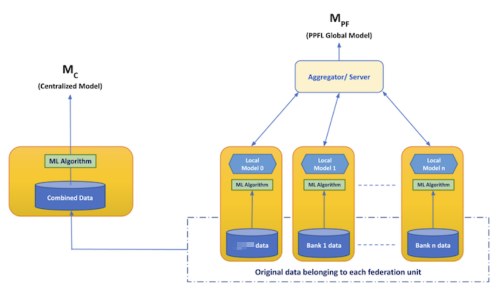

# Private Preserving Federated Learning for Financial Transaction Anomaly Detection

## Link to the Competition
- https://www.drivendata.org/competitions/group/nist-federated-learning/
- https://petsprizechallenges.com/
- https://www.drivendata.org/competitions/105/nist-federated-learning-2-financial-crime-federated/
- https://www.drivendata.org/competitions/144/nist-federated-learning-2-financial-crime-centralized/

## Installation Instruction

- Install python 3.8

- Installing packages by building conda environment from `environment.yml` file
  ```shell
  conda env create -f environment.yml
  conda activate ftad_pets
  ```
- Packages Used

	- mmh3 - to compute hash value
	- pycryptodome - to encrypt and decrypt data
	- xgboost - train model
	- flower - federated learning framework

## Run program

- **Centralized Solution**

  ```shell
  # centralized_solution solution
  cd centralized_solution
  python solution_centralized.py
  ```

- **Federated Solution**

  ```shell
  # federated solution 
  cd federated_solution
  python solution_federated.py
  ```

## Problem Description: US-PETS Financial Crime Prize

The United Nations estimates that up to $2 trillion of cross-border money laundering takes place each year, financing
organized crime and undermining economic prosperity. Financial institutions such as banks and credit agencies, along
with organizations that process transactions between institutions must protect personal and financial data, while also trying to report and deter illicit financial activities. Under this context, we will design and later develop innovative privacy-preserving federated
learning solutions that facilitate cross-institution and cross-border anomaly detection to combat financial crime. This
use case features both vertical and horizontal data partitioning.


Details see the following link:
- https://www.drivendata.org/competitions/98/nist-federated-learning-1/page/524/
- https://www.drivendata.org/competitions/105/nist-federated-learning-2-financial-crime-federated/
- https://www.drivendata.org/competitions/144/nist-federated-learning-2-financial-crime-centralized/

## Dataset Requirement and Description

Details see the following link:
- https://www.drivendata.org/competitions/98/nist-federated-learning-1/page/524/

### Demo Datasets

Because the competition organization will not release the data used in competition to public. We provide a simple self generated fake synthetic demo datasets to under `/data` folder of `federated_solutution` and `centralized_solution` so that one can run our program. In federated solution, `data/` folder contains subfolders whose names are denoted by name of clients, each of them contains the the data owned by client, for example, a bank client will has its own accounts dataset and payment system organization client will have it own transaction data.

#### Account Dataset owned by Bank Clients

The general format of dataset for bank clients is as follows:

- **Account information:** `Bank`, `Account`, `Name`, `Street`, `CountryCityZip`
- **Flags**: categorical or ordinal value indicating whether risk of account, for example, 0 means no risk, 1 means low risk

**Example of a synthetic fake dataset used in demo is as follows:**

| Bank     | Account        | Name        | Street      | CountryCityZip       | Flags |
| -------- | -------------- | ----------- | ----------- | -------------------- | ----- |
| BANK1682 | ACCOUNT74089   | acctname25  | address 200 | country_city_zip 175 | 0     |
| BANK1682 | ACCOUNT91126   | acctname186 | address 107 | country_city_zip 22  | 0     |
| BANK1682 | ACCOUNT2352638 | acctname131 | address 157 | country_city_zip 155 | 0     |

#### Transaction Dataset owned by Payment System Organization

The general format of dataset for payment system organization client is as follows:

- **Transaction IDs:** `MessageId`, `UETR`, `TransactionReference`

- **Transaction Time:** `Timestamp`, `SettlementDate`
- **Transaction Accounts:** `Sender`, `Receiver`, `OrderingAccount`, 'BeneficaryAccount', ...
- **Transaction Currency and Amount:** `SettlementAmount`, 'InstructedAmount', `SettlementCurrency`, `InstructedCurrency`
- **Label:** whether transaction is anomalous or not

**Example of a synthetic fake dataset used in demo is as follows:**

| MessageId                            | Timestamp       | UETR                                 | Sender   | Receiver | TransactionReference | OrderingAccount | OrderingName | OrderingStreet | OrderingCountryCityZip | BeneficiaryAccount | BeneficiaryName | BeneficiaryStreet | BeneficiaryCountryCityZip | SettlementDate | SettlementCurrency | SettlementAmount | InstructedCurrency | InstructedAmount | Label |
| ------------------------------------ | --------------- | ------------------------------------ | -------- | -------- | -------------------- | --------------- | ------------ | -------------- | ---------------------- | ------------------ | --------------- | ----------------- | ------------------------- | -------------- | ------------------ | ---------------- | ------------------ | ---------------- | ----- |
| ee31fd3a-9024-42c6-9440-460767522c76 | 2/6/2035 17:44  | b5d765cd-adbf-4e15-a858-ac883ab75a11 | BANK6242 | BANK1682 | tranref15            | ACCOUNT421876   | acctname60   | address 111    | country_city_zip 90    | ACCOUNT551369      | acctname154     | address 197       | country_city_zip 132      | 350206         | currency 4         | 92199419164      | currency 4         | 92199419164      | 0     |
| d603f200-3735-4cfb-a7bd-dda2027a2535 | 2/9/2035 23:21  | ec248da4-5073-41f6-ba03-7662f718464c | BANK2501 | BANK1682 | tranref52            | ACCOUNT3176524  | acctname192  | address 38     | country_city_zip 160   | ACCOUNT1           | acctname86      | address 76        | country_city_zip 99       | 350209         | currency 4         | 39253626474      | currency 4         | 39253626474      | 1     |
| 182dcb62-6abf-4368-a481-99e9c84afef4 | 2/3/2035 4:10   | fe0f3e60-90bb-456d-a29f-2287f5371ed8 | BANK65   | BANK2602 | tranref60            | ACCOUNT6331626  | acctname152  | address 127    | country_city_zip 49    | ACCOUNT857376      | acctname37      | address 34        | country_city_zip 101      | 220218         | currency 14        | 3.47E+11         | currency 6         | 3.47E+11         | 1     |
| 6e44138d-37a8-4526-9da9-e1bd26415550 | 2/20/2035 22:41 | 48bdb6a5-f12c-47e2-aa3f-c40a36bfe7a2 | BANK2705 | BANK2602 | tranref66            | ACCOUNT3375001  | acctname70   | address 144    | country_city_zip 75    | ACCOUNT6539204     | acctname121     | address 130       | country_city_zip 127      | 220220         | currency 14        | 2.3789E+11       | currency 14        | 2.3789E+11       | 1     |

#### Training and Testing Data of Payment System Organization

Payment system owns the transaction data, and the anormal transaction detection will be operated at its side, so it also contains the **label** which denotes whether a transaction is abnormal or not. The after containing the labels, the transaction data will be split into training and test data for training and evaluate a machine learning model for detecting abnormal transaction. `Transaction_train.csv` and `Transaction_test.csv` are training and test data.

## Solution

### Centralized Solution

[Centralized Solution Documentation](./centralized_solution/README.md)

### Federated Learning Solution

[Federated Solution Documentation](./federated_solution/READ.md)


