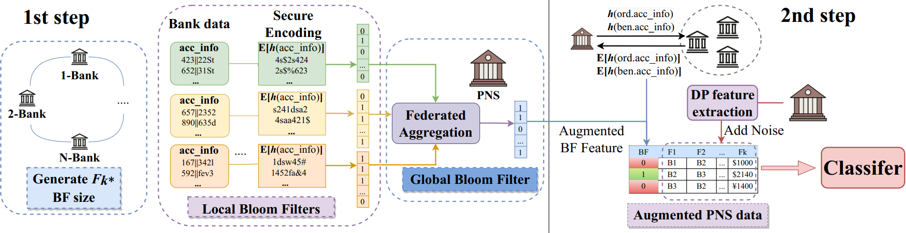

# Financial Crime Anomaly Detection via Privacy-Enhanced Two-Step Federated Learning
## Overview

We propose a novel privacy-preserving federated learning approach to identify anomalous financial transactions in Payment Network Systems (PNS ), e.g., SWIFT. Our approach utilizes a two-step anomaly detection methodology to solve the problem. In the first step, we mine features based on account-level data and labels, and then use a privacy-preserving encoding scheme to augment these features to the data held by PNS. In the second step, PNS now learns a highly accurate classifier from the augmented data.

## Solution Illustration




## Run Program

```shell
python federated_solution.py
```

## Solution Code Design

Our solution for federated learning is built upon the [Flower framework]([Flower 1.4.0](https://flower.dev/docs/)), which is well-known for its efficient and scalable approach to this field. We have utilized the client and strategy classes inherited from Flower and implemented the interface, ensuring seamless integration with the framework. For more information about the Flower framework and its capabilities, please refer to the links provided. The following link shows how client and server communicates under Flower framework - [Flower Architecture]([Implementing Strategies - Flower 1.4.0](https://flower.dev/docs/implementing-strategies.html)) 

**Folders**

- `./state/<client_id>/` used to persist all internal state (e.g. public key and private key) of all clients and server
- `./data/scenario_name/<client_id>/` contains all data owned by client

**Functionality of Client and Strategy Classes**

- `BankClient.py` implements functionality of bank clients following interfaces provided by Flower framework
  - Share its public key to server for secure communication
  - Compute secure sum with all other clients to figure out total accounts for build bloomfilter
  - Collaborate with other clients to build private preserving bloom filter to transfer `flag` of invalid account to PNS client
- `TrainPNSClient.py` and `TestPNSClient.py` implements functionality of Payment System clients following interfaces provided by Flower framework
  - Share its public key to server for secure communication
  - Construct global bloom filter from local private preserving bloom filter built by all other bank clients
  -  Train a XGboost model to detect anomalous financial transactions
- `TrainStrategy.py` implements functionality of server to do private preserving communication and computation for all clients in training phase
  - Collects public key from all clients
  - Transfer encrypted information to assist communication between all clients

- `TestStrategy.py` implements functionality of server to do private preserving communication and computation for all clients in training phase
  - Collects public key from all clients
  - Transfer encrypted information to assist communication between all clients

**Functionality of other files**

- `model3.py` contains a [XGBoost]([XGBoost Documentation — xgboost 1.7.5 documentation](https://xgboost.readthedocs.io/en/stable/)) model to identify anomalous financial transactions based on features computed by private preserving federated computation across all clients (e.g. bloom filter features)
- `bloomfilter.py` contains our implementation of a simple bloom filter
- `utils_basic.py` `utils_advanced.py`contains functions to compute hashing, encryption and decryption for secure communication and some data preprocessing functions

## Our Solution: Step-by-Step Illustration of the Computational Process

###  Whole Run Flow

In both training and test phase, the program will first setup all private and public keys, random number owned by each client for generating keys for encryption and decrytion. Then the program will start simulate the collaboration process by using the built-in function from Flower framework `fl.simulate()`, it will use different processes to represent each client and server and simulate the whole process of federated learning. 

###  Training Phase

Following shows in training phase in every round, what server and clients do

- **Code files related:**
  - BankClient.py
  - TrainStrategy.py
  - TrainPNSClient.py

- **Round 1**
  - client selected - all banks and PNS client
  - task: collect public key
    - PNS client and banks send their public key to server and server store it.
- **Round 2**
  - client selected - all banks client
  - task: collect encrypted bank names from bank client
    - every bank client sent banks it has in its partition encrypted using PNS client public key to server
- **Round 3**
  - client selected - PNS client
  - task: send hashed accounts info belong to each bank partition to server
    - server send encrypted bank names of each bank client to PNS client and PNS client decrypt them
    - PNS client compute hash of accounts and send them based on banks of each bank client
- **Round 4 - 4 + num_banks**
  - client selected - bank round - 4
  - task: securely compute common key and total accounts of all bank clients
    - every bank first decrypt the result from server to get current sum of accounts and xor of keys
    - every client encrypts its number of accounts + current sum and its key using next bank public key and send it
      to server, server send it to next bank
- **Round 4 + num_banks + 1**
  - client selected - bank 0
  - task: compute final total accounts and common key
    - bank0 decrypted result from server
    - bank0 compute final total accounts and common key from results
    - bank0 encrypted final total accounts and common key using public key of each other banks and send to server
- **Round 4 + num_banks + 2**
  - client selected - all banks
  - task: build local bloom filter and encrypted hash of accounts
    - server sends encrypted final sum and common key to every bank
    - server sends hash of accounts info belongs to each bank client to each bank client
    - every bank client decrypt to get final total accounts and use it to build bloom filter
    - every bank client decrypt to get final common computed key and use it to encrypt the hash value of accounts
      info received from server
    - every bank encrypt local bloomfilter with PNS client public key and send them with encrpted hash of accounts info
      to server
- **Final Round**
  - client selected - PNS client
  - task: build bloom filter feature and train model
    - PNS client decrypt and aggregate all local bloom filter of every bank sent by server to get global bloomfilter
    - PNS client use global bloomfilter and encrypted hash of accounts info to build bloomfilter feature - whether
      accounts info is valid or not based on Flags of bank data
    - PNS client compute some extra features
    - PNS client use bloomfilter feature and extra features to train dp version of xgboot model
    - PNS client save model

###  Test Phase

The only difference of test phase compare to training phase is in final round, PNS client load saved model and use it to do
prediction

- **Code file related:**
  - BankClient.py
  - TestStrategy.py
  - TestPNSClient.py
